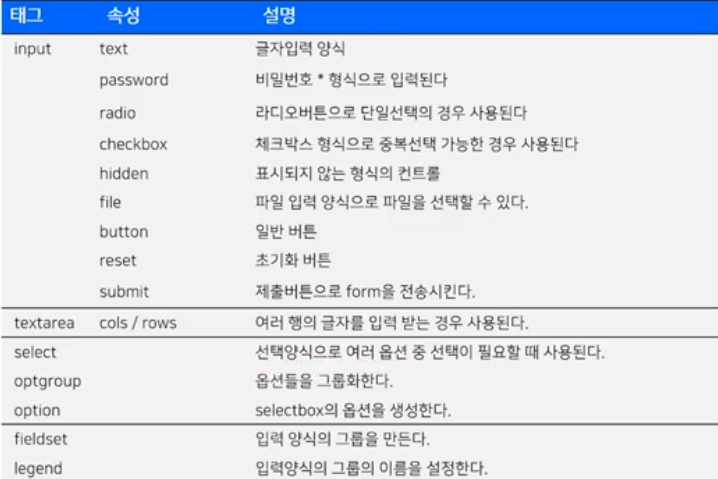

# Lecture 6
- table 태그는 요즘에는 자주 사용되지 않는 태그라고는 함
- 대체 표현 방식이 많기 때문임

## 표를 넣고 싶다면
- table: 테이블 생성
    - boarder(속성): 테두리 굵기 설정
- thead: 제목 줄
- tr: 행을 나타냄
- td: 행 안의 요소를 나타냄
- tbody: 내용 줄
- tr
- td

## 서버 전송을 위한 영역을 설정해주자
- form: 입력양식을 담는 영역
    - method(속성): 전송 방식을 결정해 줌
    - action(속성): 전송 위치, 즉 데이터를 처리하는 결과 페이지임
        > GET, POST
        - GET은 가볍고 중요하지 않은 것에, POST는 그 반대
        - GET은 255byte로 제한 됨

### 입력 양식 태그들

- 이 외에도 더 있고 필요에 따라 찾아보자
- input 아래 type 속성으로
    > 여기 button 태그로 해도 비슷함
    - button(속성값): 일반적인 버튼
    - reset(속성값): 초기화 버튼
    - submit(속성값): form을 전송
- 추가로 fieldset과 legend 태그는 요즘은 div로 대신하기에 거의 쓰이지 않는다

### HTML5에서만 가능한 추가 입력 양식
- input 아래 type 속성으로
    - color(속성값): 색상 선택
    - date(속성값): 날짜
    - time(속성값): 시간
    - number(속성값): 정수만 입력 가능
    - range(속성값): 슬라이더 바로 받음
    - tel(): 모바일에서는 숫자 입력모드로 바뀐다
    - email(): 이메일 서식이 충족되어야 한다
- input 아래 속성으로
    - autofocus(속성): 자동으로 커서를 여기에 위치시킴
    - autocomplete: 입력했던 값들을 자동완성해 줌
        > 기본값이 on 임. 끄려면 off 해줘야 함
    - placeholder: 값이 없을 때 힌트를 알려줌
    - required: 필수로 입력해야 하는 부분임을 알려줌

> 8강까지의 내용임